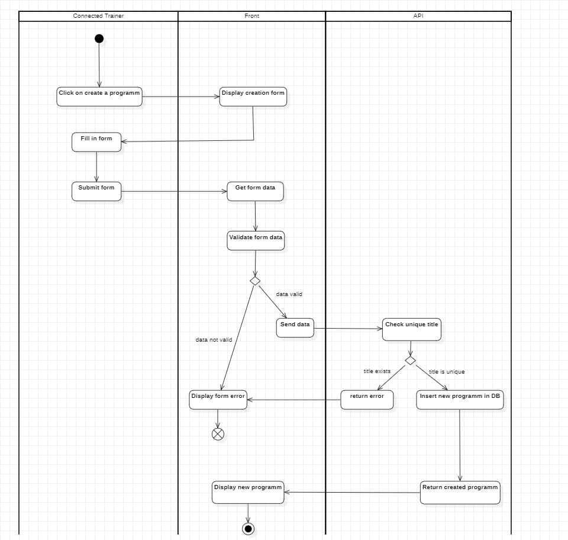

# Diagramme d'activité

Les diagrammes d' activité UML sont utilisés pour:
- Visualisation des Processus : Montre clairement les étapes et le flux de travail d’un processus.
- Identification des Goulots d'Étranglement : Aide à repérer les points de blocage pour optimiser les opérations.
- Communication et Collaboration : Facilite la compréhension et la collaboration entre les parties prenantes.
- Documentation et Référencement : Sert de référence pour le développement, la formation, et le support.

### Swimlanes:

1. **Formateur** : déjà connecté
2. **Front**
3. **API**

### Diagramme d'Activités

1. **Formateur**
    - S'authentifier
    - Accéder à l'interface de création de formation
    - Saisir les informations de la formation
    - Soumettre la création de la formation
      
2. **Front**
    - Afficher la page de connexion
    - Vérifier les informations d'authentification
    - Afficher l'interface de création de formation
    - Collecter les informations de la formation saisies par le formateur
    - Valider les informations de la formation
    - Envoyer les données de la formation à l'API
3. **API**
    - Recevoir les informations de la formation depuis le Front
    - Valider les informations reçues
    - Vérifie que le titre de la formation est unique
    - Créer l'entrée de formation dans la base de données
    - Retourner la confirmation de création au Front
  
