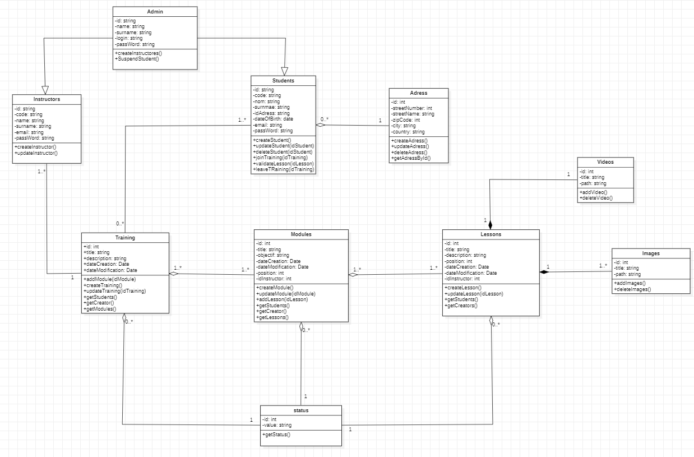

# Diagramme de classe

Les diagrammes de classe sont utilisés pour : 
- Visualiser la Structure Statique: Représente les classes et leurs relations dans le système.
- Identifier les Relations: Montre les associations, héritages, et dépendances entre les classes.
- Décrire Attributs et Méthodes: Détaille les propriétés et comportements des classes.
- Base pour Conception et Documentation: Fournit une référence pour la conception et la documentation du système.

- Une **formation** est composée de **plusieurs modules** et chaque **module** appartient à **une ou plusieurs** **formation**.
- Si la formation est supprimée, l'association avec les modules est supprimée mais pas le module. 

- Un **module** est composé de **plusieurs cours** et chaque **cours** appartient à **un ou plusieurs module**.
- - Si le module est supprimé, l'association avec les cous est supprimée mais pas le cours. 

- Chaque **cours** contient une **image** et chaque **image** appartient à un **cours**. Si le cours est supprimé , l'image est supprimée

- Chaque **cours** contient une **vidéo** et chaque **vidéo** appartient à un **cours**.  Si le cours est supprimé , la vidéo est supprimée

- Un **formateur** peut créer **plusieurs formations** et chaque **formation** est créée par un **formateur**.

- Un **formateur** peut créer **plusieurs modules** et chaque **module** est créé par un **formateur**.

- Un **formateur** peut écrire **plusieurs cours** et chaque **cours** est écrit par un **formateur**.
 
- Un **apprenant** peut suivre **plusieurs formations** et chaque **formation** peut être suivie par **0 ou plusieurs apprenants**.

- Un **statut** peut être associé à **0 ou plusieurs formations** et chaque **formation** a un **statut**.

- Un **statut** peut être associé à **0 ou plusieurs modules** et chaque **module** a un **statut**.
   
- Un **statut** peut être associé à **0 ou plusieurs cours** et chaque **cours** a un **statut**.
  
- Un administrateur herite de toutes les méthodes des formateurs et des apprenants 
