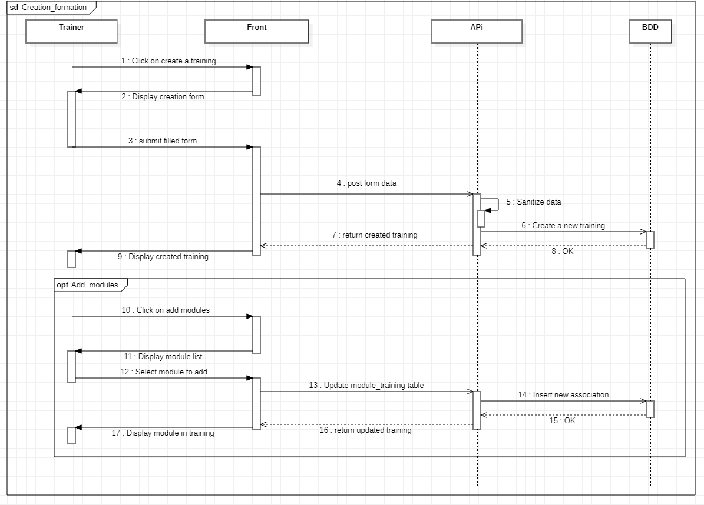
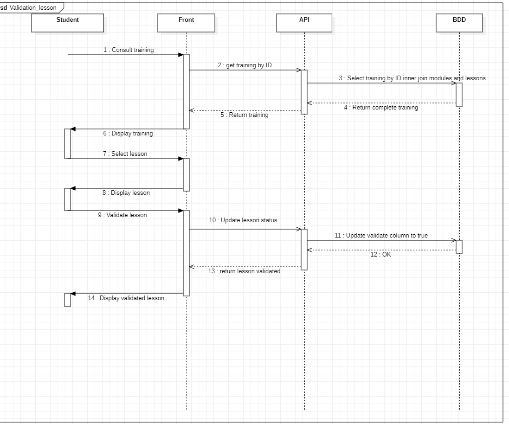

# Diagramme de séquence 

**Les diagrammes de séquence UML sont des outils précieux pour:**

- Visualiser le déroulement **temporel** des interactions dans un système.
- Identifier les objets impliqués dans une interaction.
- Décrire les états des objets.
- Servir de base à la documentation et à la conception.

## Création d'un formation 

## validation d'une leçon 

## Étapes du Diagramme de Séquence pour la Création d'une Formation

### 1. **Initiation par le Formateur**

1. **Formateur → Frontend**:
    - **Action**: Cliquer sur créer une formation
    - **Message**: "Soumettre le formulaire de création"

2. **Formateur → Frontend**:
    - **Action**: Soumettre les détails de la formation (intitulé, description, etc.)
    - **Message**: "Soumettre les détails de la formation"

### 2. **Frontend Vérifie les Données**

1. **Frontend → Formateur**:
    - **Action**: Vérifier que toutes les informations nécessaires sont fournies
    - **Message**: "Vérifier les données de la formation"

### 3. **Frontend Envoie la Requête à l'API**

1. **Frontend → API**:
    - **Action**: Envoyer les détails de la formation pour traitement
    - **Message**: "Créer formation (intitulé, description, etc.)"

### 4. **API Valide les Données**

1. **API → API**:
    - **Action**: Valider les données de la formation
    - **Message**: "Validation des données de la formation"
      
2. **API → BDD**:
    - **Action**: Enregistrer les détails de la formation dans la base de données
    - **Message**: "Enregistrer formation"

### 5. **BDD Stocke les Informations**

1. **BDD → API**:
    - **Action**: Confirmer l'enregistrement réussi de la formation
    - **Message**: "Formation enregistrée avec succès"

### 6. **API Informe le Frontend**

1. **API → Frontend**:
    - **Action**: Envoyer un message de confirmation
    - **Message**: "Confirmation de la création ou message d'erreur"

### 7. **Frontend Affiche le Résultat au Formateur**

1. **Frontend → Formateur**:
    - **Action**: Afficher la confirmation
    - **Message**: "Afficher confirmation de la création ou message d'erreur"

## Étapes du Diagramme de Séquence pour la Validation d'une Leçon

### 1. **Sélection de la Formation par l'Apprenant**

1. **Apprenant → Frontend**:
    - **Action**: Sélectionner une formation

### 2. **Frontend Affiche les Détails de la Formation**

1. **Frontend → API**:
    - **Action**: Rechercher la formation par son ID et obtenir les modules et leçons
 
2. **API → BDD**:
    - **Action**: Rechercher la formation, les modules et les leçons associés dans la base de données
   
3. **BDD → API**:
    - **Action**: Retourner les détails de la formation, les modules et les leçons
  
4. **API → Frontend**:
    - **Action**: Envoyer les détails de la formation au frontend
   
5. **Frontend → Apprenant**:
    - **Action**: Afficher les détails de la formation, y compris les modules et les leçons
    

### 3. **Sélection et Validation de la Leçon par l'Apprenant**

1. **Apprenant → Frontend**:
    - **Action**: Sélectionner la leçon à valider
   
2. **Frontend → Apprenant**:
    - **Action**: Afficher la leçon sélectionnée avec un bouton de validation
   
3. **Apprenant → Frontend**:
    - **Action**: Cliquer sur "Valider leçon"
  
### 4. **Frontend Envoie la Requête à l'API**

1. **Frontend → API**:
    - **Action**: Envoyer la demande de validation de la leçon pour traitement
 

### 5. **API Valide les Données**

1. **API → BDD**:
    - **Action**: Enregistrer la validation de la leçon dans la base de données
  

### 6. **BDD Met à Jour les Informations**

1. **BDD → API**:
    - **Action**: Confirmer l'enregistrement de la validation de la leçon
    - **Message**: "Validation enregistrée avec succès"

### 7. **API Informe le Frontend**

1. **API → Frontend**:
    - **Action**: Envoyer une confirmation au frontend
    - **Message**: "Confirmation de la validation "

### 8. **Frontend Affiche le Résultat à l'Apprenant**

1. **Frontend → Apprenant**:
    - **Action**: Afficher la confirmation de la validation
    - **Message**: "Afficher confirmationr"
