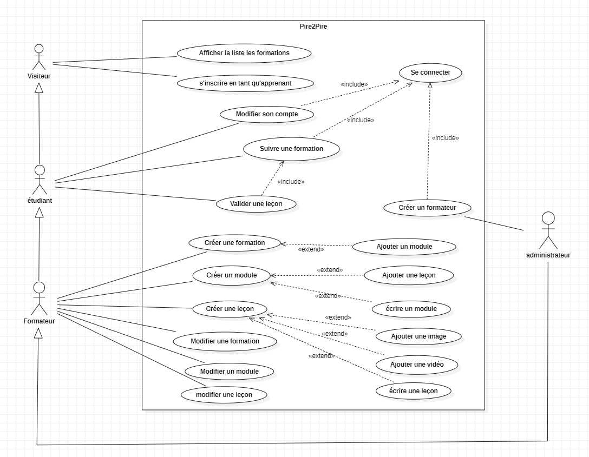

# Diagramme de cas d'utilisation 

**Les diagrammes de cas d'utilisation UML sont des outils précieux pour:**

- Spécifier les fonctionnalités d'un système.
- Identifier les utilisateurs du système.
- Visualiser les interactions entre les utilisateurs et le système.
- Servir de base à la conception ultérieure du système.

Les flèches "Inclut" ne sont pas toutes représentées pour la lisibilité du diagramme mais tous les cas d'utilisation de l'apprenant, du formateur et de l'administrateur demandent à ce qu'ils soient connectés. 

1. **Gérer les formations**
    - **Créer une formation** (Formateur)
        - **Inclut**: S'authentifier
        - **Extension**: Ajouter un module
    - **Modifier une formation** (Formateur, Administrateur)
        - **Inclut**: S'authentifier
        - **Extension**: Ajouter des modules, Modifier les tags, Modifier les images/vidéos
    - **Voir les formations disponibles** (Visiteur, Apprenant)
        - **Inclut**: Rechercher des formations
    - **Suivre une formation** (Apprenant)
        - **Inclut**: S'authentifier
        - 
2. **Gérer les modules**
    - **Créer un module** (Formateur)
        - **Inclut**: S'authentifier
        - **Extension**: Ajouter des cours, écrire le module
    - **Modifier un module** (Formateur, Administrateur)
        - **Inclut**: S'authentifier
          
3. **Gérer les cours**
    - **Créer un cours** (Formateur)
        - **Inclut**: S'authentifier
        - **Extension**: écrire le cours, Ajouter des images/vidéos
    - **Modifier un cours** (Formateur, Administrateur)
        - **Inclut**: S'authentifier
    - **Valider un cours** (Apprenant)
        - **Inclut**: S'authentifier
          

5. **Gérer les utilisateurs**
    - **Inscription** (Visiteur)
    - **Connexion** (Apprenant, Formateur, Administrateur)
    - **Définir les rôles des utilisateurs** (Administrateur)
        - **Inclut**: S'authentifier
    - **Modifier les informations personnelles** (Apprenant, Formateur, Administrateur)
        - **Inclut**: S'authentifier
